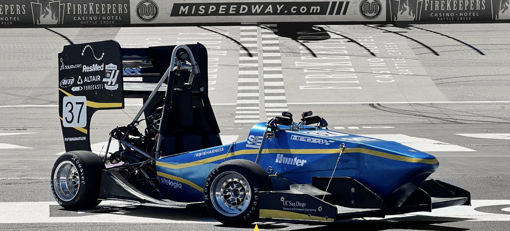

# Ben Zhang
---
> I really don't have a quote for quote.
## **Directory**
---
  - [**About Me**](#About_Me)
  - [**Stuff I do**](#Stuff_I_do)
  - [**Coding Project**](#Coding_Project)
  - [**CheckList For this Task**](#CheckList_For_this_Task)

## **About_Me**
Hello, I am an enthusiastic in both Hardware and Software Engineering. Who studied too much EE last year and really need to catch up with programing stuff.

[Check out my Website](https://han-zhang.cn)

## **Stuff_I_do**

- Basically building this for the last 2 years

1. *Mechanic Skills*
   - CAD/SolidWorks
   - Circuit/PCB Design
   - Tooling
2. *Programming*
   - Modeling data for visualization in MATLAB
   - Basic understanding in Python, Java, C, C++, SQL, Linux commands.
3. *Leadership/Communication Skill*
   - Admin in UCSD Triton Racing to organize and lead projects for building a race car.

### Coding_Project
--- an old highschool project to recreate PAC-MAN, only one of the function shown.

```
def color_detection(x, y, bg):
    #DDetect the boundaries around the Pac-Man
    for a in range(x, x + 20):
        for b in range(y, y + 20):
            color = screen.get_at((a,b))
            #Determine the colors (Didn't work with color == (0, 0, 255, 255))
            if color != (0, 0, 0, 255) and color != (1, 1, 0, 255) and color != (0, 0, 0, 255) and color != (1, 0, 0, 255) and  color != (0, 1, 0, 255) and color != (255, 255, 255, 255) and color != (0, 0, 1, 255) and color != (1, 0, 1, 255) and color != (0, 1, 1, 255) and color != (1, 1, 1, 255):
                returned = False
                break
            else:
                returned = True
        if returned == False:
            break
    return returned
```

## **CheckList_For_this_Task**
---

- [x] Pictures
- [x] Headings
- [x] Styling text
- [x] Quoting text
- [x] Quoting code
- [x] External Links
- [x] Section links
- [x] Relative links 
- [x] Ordered and Unordered Lists
- [x] Task lists
- [ ] I hope I didn't miss something